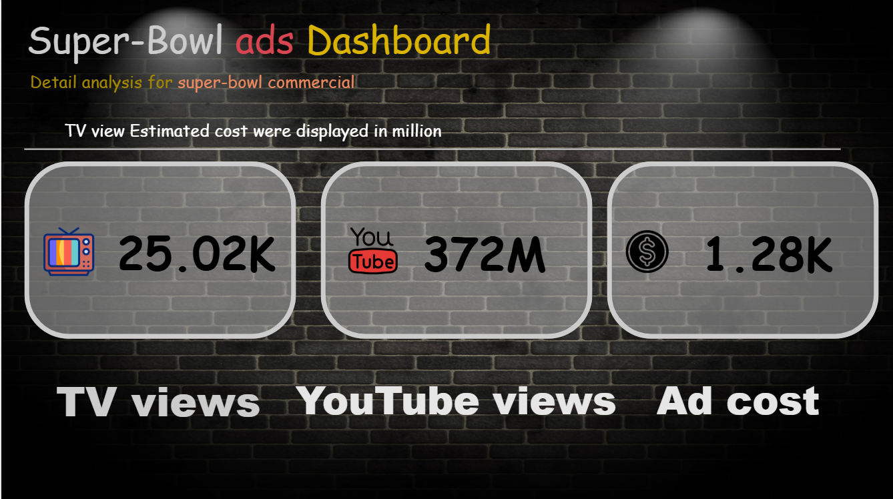
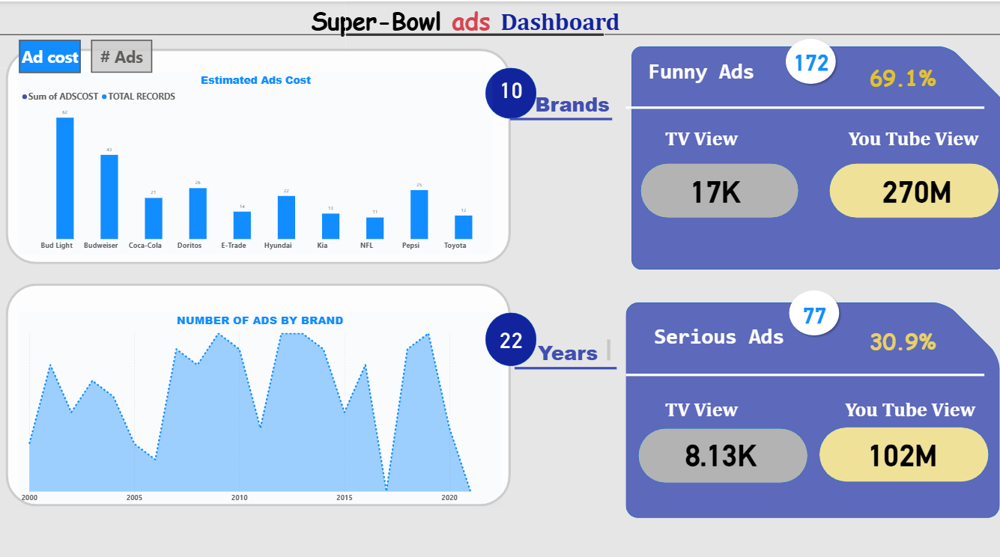

# Super Bowl Ads Dashboard 🎯

This project contains an interactive **Power BI dashboard** analyzing Super Bowl advertisements.  
It provides insights into ad costs, views, and trends across brands and years.

## 📊 Features
- **Estimated Ad Costs** by brand (Bud Light, Coca-Cola, Pepsi, etc.)
- **Ad Type Analysis** – Funny Ads vs Serious Ads
- **Views Comparison** – TV vs YouTube
- **Trends Over 22 Years** in number of ads
- **Overall Metrics**: Total views and total cost

## 📷 Dashboard Preview
### Overview


### Detailed Analysis


## 🛠️ Tools Used
- **Power BI** for dashboard creation
- **Excel/CSV dataset** (Super Bowl Ads data)

## 🚀 How to Use
1. Clone this repository:
   ```bash
   git clone https://github.com/your-username/super-bowl-ads-dashboard.git
